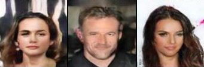

---

# Spectral Aware GAN

[](https://pytorch.org/)
[](https://www.python.org/)

A novel Deep Convolutional Generative Adversarial Network (DCGAN) implementation enhanced with **Fourier Space Loss** to improve training stability and image quality. This project explores the integration of frequency domain analysis with traditional GAN training.

## Project Overview

Traditional GANs often struggle with training instability and mode collapse. This project addresses these challenges by incorporating **Fourier Space Loss** alongside the standard adversarial loss. The Fourier loss helps the generator learn better spatial frequency distributions, leading to more stable training and higher quality image generation.

**Key Innovations:**
- **Dual-Loss Training:** Combines standard adversarial loss with Fourier domain loss
- **Frequency Domain Supervision:** Ensures generated images have realistic frequency characteristics
- **Improved Stability:** More consistent training dynamics compared to vanilla DCGAN
- **Enhanced Image Quality:** Better texture and structural details in generated images

## Installation & Setup

### Prerequisites

- Python 3.8+
- CUDA-capable GPU (recommended for training)
- PyTorch 2.6+

### Installation

1. **Clone the repository:**
```bash
git clone https://github.com/Hemanth2332/DCGAN_fourier_loss.git
cd DCGAN_fourier_loss
```

2. **Create a virtual environment (recommended):**
```bash
python -m venv venv
source venv/bin/activate  # On Windows: venv\Scripts\activate
```

3. **Install dependencies:**

```bash
pip install torch torchvision torchaudio matplotlib numpy pillow opencv-python tqdm tensorboard
```

## Usage

### Training the Model

1. **Prepare your dataset:**
   - Place images in the `data/` directory
   - Supported formats: JPEG, PNG, etc.
   - Images will be automatically resized and normalized

2. **Configure training parameters:**
   - Modify parameters in `config.py` or pass as command-line arguments
   - Key parameters: `fourier_weight`, `image_size`, `batch_size`

3. **Start training:**
```bash
python train.py
```

Modify configurations from `config.py`

**Key Training Parameters:**
- `dataset`: Path to training images
- `fourier_weight`: Weight for Fourier loss component (default: 0.1)
- `image_size`: Spatial size of training images (default: 128)
- `batch_size`: Batch size for training (default: 128)
- `lr`: Learning rate (default: 0.0002)
- `epochs`: Number of training epochs (default: 50)


## Model Architecture

### Generator
- **Input:** Random noise vector (latent space)
- **Architecture:** Transposed convolutional layers with batch normalization
- **Activation:** ReLU (hidden layers), Tanh (output)
- **Output:** Generated image matching training data distribution

### Discriminator
- **Input:** Real or generated images
- **Architecture:** Convolutional layers with batch normalization
- **Activation:** LeakyReLU (hidden layers), Sigmoid (output)
- **Output:** Probability of input being real

### Fourier Loss Component
- **Operation:** Fast Fourier Transform (FFT) on generated and real images
- **Comparison:** L1/L2 distance between frequency domain representations
- **Purpose:** Enforce realistic frequency characteristics in generated images

## Fourier Loss Formulation

The Fourier loss enforces frequency domain consistency between real and generated images:

**Mathematical Definition:**

Let:
- **x** ∼ p_data: Real images from data distribution
- **G(z)**: Generated images from generator
- **F₂**: 2D Discrete Fourier Transform

The Fourier loss is defined as:

```math
L_F = 𝔼[‖ |F₂(G(z))| - |F₂(x)| ‖₁]
```

**Components:**
- **Magnitude Spectrum**: |F₂(·)| extracts amplitude information
- **L1 Distance**: ‖·‖₁ ensures sparse frequency error penalization
- **Expectation**: 𝔼[·] averages over batch and spatial dimensions

**Implementation:**
```math
L_F = mean(|FFT2(G(z))| - |FFT2(x)|)
```

This loss ensures generated images maintain similar spectral characteristics as real data.

**Total Loss Function:**
```
Total Loss = Adversarial Loss + λ × Fourier Loss
```
Where `λ` is the Fourier loss weight parameter.

Here's the updated section with TensorBoard logging added:

## 📊 Results & Evaluation

### Training Monitoring
- **TensorBoard Logging**: Real-time visualization of training metrics, loss curves, and generated samples
- **Loss curves** for generator and discriminator with Fourier loss components
- **Generated samples** at regular intervals with progressive quality tracking
- **Fourier domain comparisons** between real and generated images
- **Inception Score (IS)** and **Fréchet Inception Distance (FID)** for quantitative evaluation

### TensorBoard Integration
The project includes comprehensive TensorBoard logging for monitoring training progress:

```bash
# Launch TensorBoard to monitor training
tensorboard --logdir=runs/
```

**Tracked Metrics:**
- Generator and Discriminator losses
- Fourier loss component
- Real vs Generated image comparisons
- Frequency spectrum visualizations
- Model graph architecture
- Gradient distributions and histograms




### Expected Improvements
- ✅ **More stable training** with reduced mode collapse
- ✅ **Better texture quality** in generated images  
- ✅ **Improved frequency characteristics** matching real data
- ✅ **Faster convergence** in some datasets
- ✅ **Comprehensive monitoring** through TensorBoard visualization

## 🧪 Experiments

### Datasets
- **CelebA**: Face generation
- **CIFAR-10**: Object generation
- **Custom Datasets**: Support for any image folder

### Ablation Studies
- Effect of Fourier loss weight on image quality
- Comparison with vanilla DCGAN training
- Frequency domain analysis of generated images

## Future Work

- [ ] Extension to StyleGAN architectures
- [ ] Multi-scale Fourier loss
- [ ] Phase information incorporation
- [ ] Application to specific domains (medical imaging, art)
- [ ] Real-time frequency domain visualization
- [ ] Hyperparameter optimization studies

---

